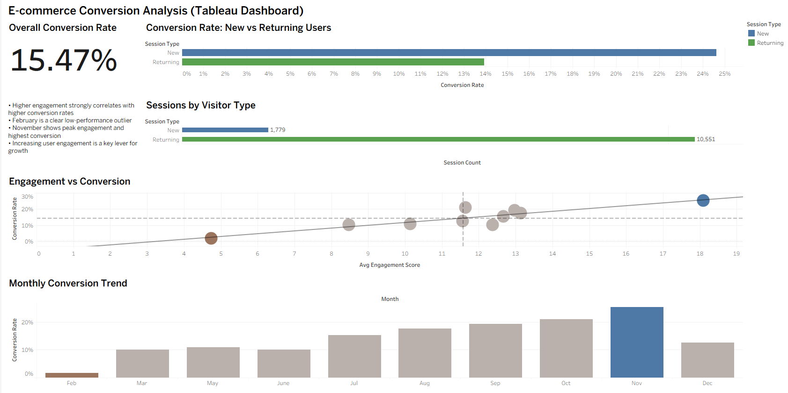
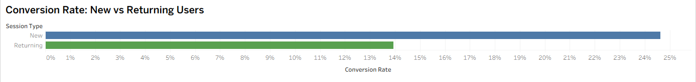
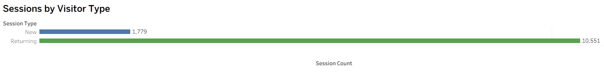
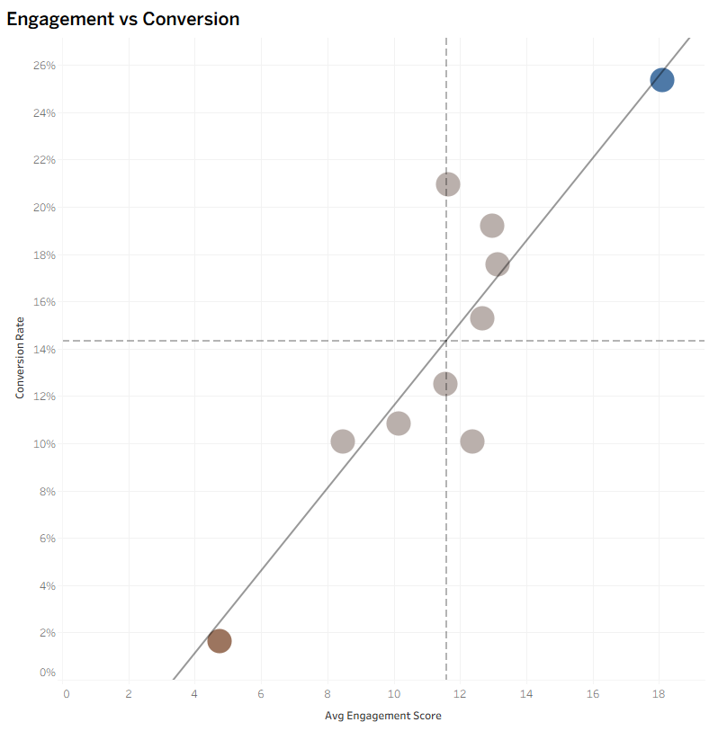
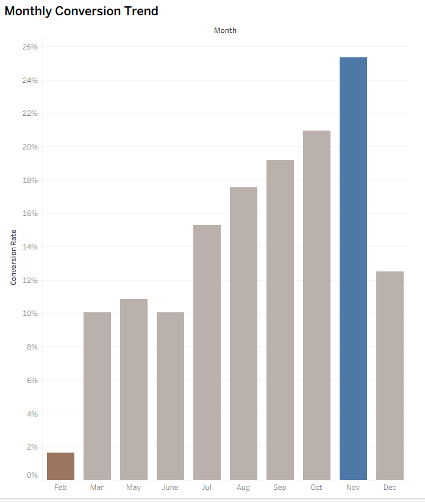

# 📊 E-commerce Conversion Analysis (Tableau Dashboard)

## 📌 Project Overview

This project analyzes user behavior and conversion performance using an e-commerce session dataset. The goal is to identify key drivers of conversion, evaluate user segments, and uncover actionable insights to improve business performance.

The analysis focuses on three core questions:

- What drives higher conversion rates?
- How do new vs returning users behave differently?
- How does conversion performance change over time?

The final deliverable is an interactive Tableau dashboard designed for business stakeholders.

---

## 🧰 Tools & Technologies

- Tableau Public — Data visualization & dashboarding  
- Excel / CSV — Data source  
- Analytics Techniques:
  - Segmentation analysis
  - Conversion rate analysis
  - Correlation analysis
  - Time series trend analysis

---

## 📊 Dataset Description

- Source: UCI Online Shoppers Purchasing Intention Dataset  
- ~12,000 user sessions  
- Each row represents a single user session  

Key fields include:
- Visitor Type (New vs Returning)
- Engagement metrics (page views, durations)
- Conversion flag (purchase or not)
- Month of visit

---

## 📈 Dashboard Overview

---

## 🔑 Key Metrics

- Overall Conversion Rate: **15.47%**

---

## 📊 Analysis & Insights

### 1. Conversion by User Type

**Insight:**
Returning visitors account for ~86% of sessions but convert at a lower rate than new visitors.

- New Visitors: ~25% conversion  
- Returning Visitors: ~14% conversion  

**Interpretation:**
New visitors likely arrive with higher purchase intent, while returning users include more browsing behavior.

**Business Implication:**
- Optimize returning user journeys (remarketing, personalization)
- Scale high-performing acquisition channels

---

### 2. Session Distribution by User Type

**Insight:**
- Returning users dominate traffic (~10.5K sessions)
- New users represent a much smaller share (~1.7K sessions)

**Interpretation:**
Higher traffic volume does not guarantee higher performance.

**Business Implication:**
Focus on improving conversion efficiency rather than just increasing traffic.

---

### 3. Engagement vs Conversion Relationship

**Insight:**
There is a strong positive relationship between engagement and conversion rate.

- Higher engagement → higher likelihood of purchase  
- Clear upward trend confirms correlation  

**Additional Observations:**
- February is a low-performance outlier  
- November shows peak performance  

**Business Implication:**
Improving user engagement is a key lever for increasing conversions.

---

### 4. Monthly Conversion Trends

**Insight:**
Conversion rates increase throughout the year:

- Lowest: February (~1–2%)  
- Highest: November (~25%)  

**Interpretation:**
Strong seasonal behavior with peak performance in Q4.

**Business Implication:**
Align marketing spend and operational readiness with high-conversion periods.

---

## 🧠 Key Takeaways

- Engagement strongly correlates with conversion performance  
- New users convert at a higher rate despite lower traffic volume  
- Returning users represent a major optimization opportunity  
- Conversion is highly seasonal, peaking in November  

---

## 🚀 Recommendations

1. Increase engagement through UX and content improvements  
2. Improve returning user conversion with personalization and retargeting  
3. Scale acquisition channels driving high-intent traffic  
4. Leverage seasonality by prioritizing high-conversion periods  

---

## 📌 Limitations

- Traffic sources are encoded and not interpretable  
- No detailed channel attribution available  
- Analysis is session-based (not user-lifetime analysis)  

---

## 📎 Live Dashboard

[View Tableau Dashboard](https://public.tableau.com/app/profile/alex.oliynyk/viz/E-commerceConversionAnalysisDashboard_17764759399110/ConversionAnalyticsDashboardOnlineShoppers)

---

## 💼 Why This Project Matters

This project demonstrates the ability to:

- Translate data into actionable business insights  
- Analyze user behavior and conversion drivers  
- Build clean, stakeholder-ready dashboards  
- Communicate findings clearly and effectively  
